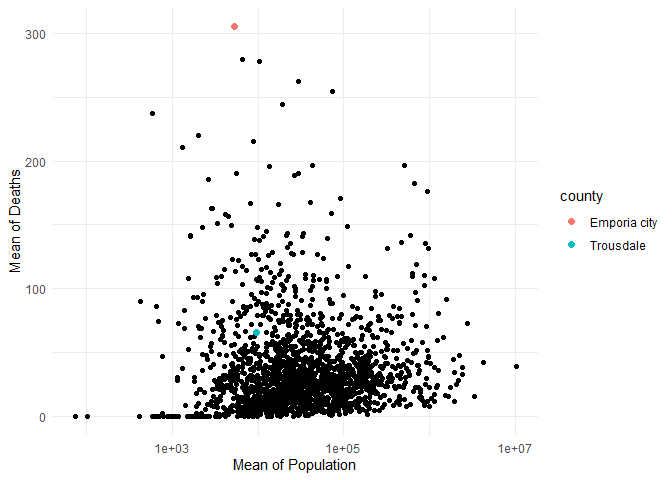
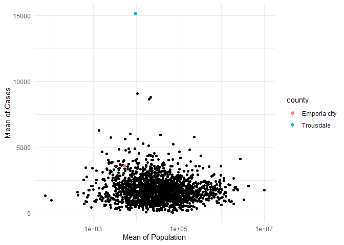
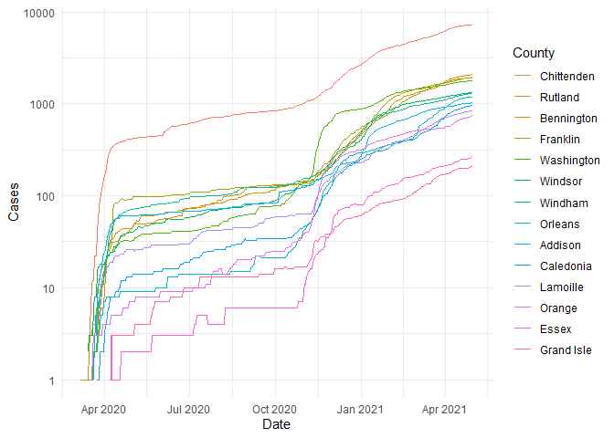
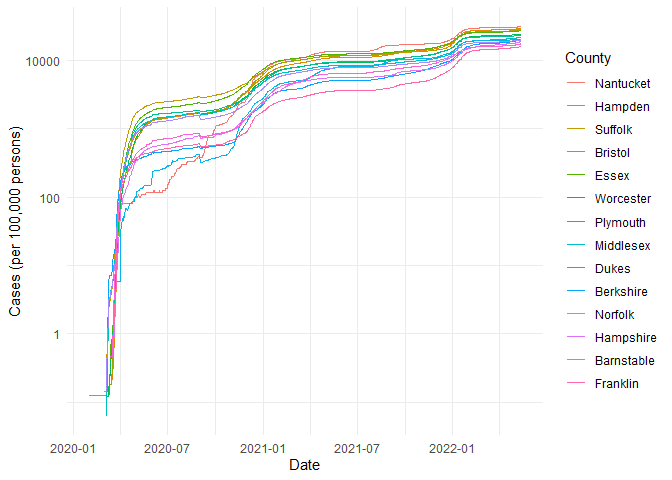

COVID-19
================
Leslie Bostwick
2025-03-12

- [Grading Rubric](#grading-rubric)
  - [Individual](#individual)
  - [Submission](#submission)
- [The Big Picture](#the-big-picture)
- [Get the Data](#get-the-data)
  - [Navigating the Census Bureau](#navigating-the-census-bureau)
    - [**q1** Load Table `B01003` into the following tibble. Make sure
      the column names are
      `id, Geographic Area Name, Estimate!!Total, Margin of Error!!Total`.](#q1-load-table-b01003-into-the-following-tibble-make-sure-the-column-names-are-id-geographic-area-name-estimatetotal-margin-of-errortotal)
  - [Automated Download of NYT Data](#automated-download-of-nyt-data)
    - [**q2** Visit the NYT GitHub repo and find the URL for the **raw**
      US County-level data. Assign that URL as a string to the variable
      below.](#q2-visit-the-nyt-github-repo-and-find-the-url-for-the-raw-us-county-level-data-assign-that-url-as-a-string-to-the-variable-below)
- [Join the Data](#join-the-data)
  - [**q3** Process the `id` column of `df_pop` to create a `fips`
    column.](#q3-process-the-id-column-of-df_pop-to-create-a-fips-column)
  - [**q4** Join `df_covid` with `df_q3` by the `fips` column. Use the
    proper type of join to preserve *only* the rows in
    `df_covid`.](#q4-join-df_covid-with-df_q3-by-the-fips-column-use-the-proper-type-of-join-to-preserve-only-the-rows-in-df_covid)
- [Analyze](#analyze)
  - [Normalize](#normalize)
    - [**q5** Use the `population` estimates in `df_data` to normalize
      `cases` and `deaths` to produce per 100,000 counts \[3\]. Store
      these values in the columns `cases_per100k` and
      `deaths_per100k`.](#q5-use-the-population-estimates-in-df_data-to-normalize-cases-and-deaths-to-produce-per-100000-counts-3-store-these-values-in-the-columns-cases_per100k-and-deaths_per100k)
  - [Guided EDA](#guided-eda)
    - [**q6** Compute some summaries](#q6-compute-some-summaries)
    - [**q7** Find and compare the top
      10](#q7-find-and-compare-the-top-10)
  - [Self-directed EDA](#self-directed-eda)
    - [**q8** Drive your own ship: You’ve just put together a very rich
      dataset; you now get to explore! Pick your own direction and
      generate at least one punchline figure to document an interesting
      finding. I give a couple tips & ideas
      below:](#q8-drive-your-own-ship-youve-just-put-together-a-very-rich-dataset-you-now-get-to-explore-pick-your-own-direction-and-generate-at-least-one-punchline-figure-to-document-an-interesting-finding-i-give-a-couple-tips--ideas-below)
    - [Ideas](#ideas)
    - [Aside: Some visualization
      tricks](#aside-some-visualization-tricks)
    - [Geographic exceptions](#geographic-exceptions)
- [Notes](#notes)

*Purpose*: In this challenge, you’ll learn how to navigate the U.S.
Census Bureau website, programmatically download data from the internet,
and perform a county-level population-weighted analysis of current
COVID-19 trends. This will give you the base for a very deep
investigation of COVID-19, which we’ll build upon for Project 1.

<!-- include-rubric -->

# Grading Rubric

<!-- -------------------------------------------------- -->

Unlike exercises, **challenges will be graded**. The following rubrics
define how you will be graded, both on an individual and team basis.

## Individual

<!-- ------------------------- -->

| Category    | Needs Improvement                                                                                                | Satisfactory                                                                                                               |
|-------------|------------------------------------------------------------------------------------------------------------------|----------------------------------------------------------------------------------------------------------------------------|
| Effort      | Some task **q**’s left unattempted                                                                               | All task **q**’s attempted                                                                                                 |
| Observed    | Did not document observations, or observations incorrect                                                         | Documented correct observations based on analysis                                                                          |
| Supported   | Some observations not clearly supported by analysis                                                              | All observations clearly supported by analysis (table, graph, etc.)                                                        |
| Assessed    | Observations include claims not supported by the data, or reflect a level of certainty not warranted by the data | Observations are appropriately qualified by the quality & relevance of the data and (in)conclusiveness of the support      |
| Specified   | Uses the phrase “more data are necessary” without clarification                                                  | Any statement that “more data are necessary” specifies which *specific* data are needed to answer what *specific* question |
| Code Styled | Violations of the [style guide](https://style.tidyverse.org/) hinder readability                                 | Code sufficiently close to the [style guide](https://style.tidyverse.org/)                                                 |

## Submission

<!-- ------------------------- -->

Make sure to commit both the challenge report (`report.md` file) and
supporting files (`report_files/` folder) when you are done! Then submit
a link to Canvas. **Your Challenge submission is not complete without
all files uploaded to GitHub.**

``` r
library(tidyverse)
```

    ## Warning: package 'tidyverse' was built under R version 4.4.2

    ## ── Attaching core tidyverse packages ──────────────────────── tidyverse 2.0.0 ──
    ## ✔ dplyr     1.1.4     ✔ readr     2.1.5
    ## ✔ forcats   1.0.0     ✔ stringr   1.5.1
    ## ✔ ggplot2   3.5.1     ✔ tibble    3.2.1
    ## ✔ lubridate 1.9.3     ✔ tidyr     1.3.1
    ## ✔ purrr     1.0.2     
    ## ── Conflicts ────────────────────────────────────────── tidyverse_conflicts() ──
    ## ✖ dplyr::filter() masks stats::filter()
    ## ✖ dplyr::lag()    masks stats::lag()
    ## ℹ Use the conflicted package (<http://conflicted.r-lib.org/>) to force all conflicts to become errors

*Background*:
[COVID-19](https://en.wikipedia.org/wiki/Coronavirus_disease_2019) is
the disease caused by the virus SARS-CoV-2. In 2020 it became a global
pandemic, leading to huge loss of life and tremendous disruption to
society. The New York Times (as of writing) publishes up-to-date data on
the progression of the pandemic across the United States—we will study
these data in this challenge.

*Optional Readings*: I’ve found this [ProPublica
piece](https://www.propublica.org/article/how-to-understand-covid-19-numbers)
on “How to understand COVID-19 numbers” to be very informative!

# The Big Picture

<!-- -------------------------------------------------- -->

We’re about to go through *a lot* of weird steps, so let’s first fix the
big picture firmly in mind:

We want to study COVID-19 in terms of data: both case counts (number of
infections) and deaths. We’re going to do a county-level analysis in
order to get a high-resolution view of the pandemic. Since US counties
can vary widely in terms of their population, we’ll need population
estimates in order to compute infection rates (think back to the
`Titanic` challenge).

That’s the high-level view; now let’s dig into the details.

# Get the Data

<!-- -------------------------------------------------- -->

1.  County-level population estimates (Census Bureau)
2.  County-level COVID-19 counts (New York Times)

## Navigating the Census Bureau

<!-- ------------------------- -->

**Steps**: Our objective is to find the 2018 American Community
Survey\[1\] (ACS) Total Population estimates, disaggregated by counties.
To check your results, this is Table `B01003`.

1.  Go to [data.census.gov](data.census.gov).
2.  Scroll down and click `View Tables`.
3.  Apply filters to find the ACS **Total Population** estimates,
    disaggregated by counties. I used the filters:

- `Topics > Populations and People > Counts, Estimates, and Projections > Population Total`
- `Geography > County > All counties in United States`

5.  Select the **Total Population** table and click the `Download`
    button to download the data; make sure to select the 2018 5-year
    estimates.
6.  Unzip and move the data to your `challenges/data` folder.

- Note that the data will have a crazy-long filename like
  `ACSDT5Y2018.B01003_data_with_overlays_2020-07-26T094857.csv`. That’s
  because metadata is stored in the filename, such as the year of the
  estimate (`Y2018`) and my access date (`2020-07-26`). **Your filename
  will vary based on when you download the data**, so make sure to copy
  the filename that corresponds to what you downloaded!

### **q1** Load Table `B01003` into the following tibble. Make sure the column names are `id, Geographic Area Name, Estimate!!Total, Margin of Error!!Total`.

*Hint*: You will need to use the `skip` keyword when loading these data!

``` r
## TASK: Load the census bureau data with the following tibble name.

filename <- "./data/ACSDT5Y2018.B01003-Data.csv"

## Load the data
df_pop <- read_csv(filename, skip = 1) %>% 
  rename_at('Geography', ~'id')
```

    ## New names:
    ## Rows: 3220 Columns: 5
    ## ── Column specification
    ## ──────────────────────────────────────────────────────── Delimiter: "," chr
    ## (3): Geography, Geographic Area Name, Margin of Error!!Total dbl (1):
    ## Estimate!!Total lgl (1): ...5
    ## ℹ Use `spec()` to retrieve the full column specification for this data. ℹ
    ## Specify the column types or set `show_col_types = FALSE` to quiet this message.
    ## • `` -> `...5`

``` r
df_pop 
```

    ## # A tibble: 3,220 × 5
    ##    id      `Geographic Area Name` `Estimate!!Total` Margin of Error!!Tot…¹ ...5 
    ##    <chr>   <chr>                              <dbl> <chr>                  <lgl>
    ##  1 050000… Autauga County, Alaba…             55200 *****                  NA   
    ##  2 050000… Baldwin County, Alaba…            208107 *****                  NA   
    ##  3 050000… Barbour County, Alaba…             25782 *****                  NA   
    ##  4 050000… Bibb County, Alabama               22527 *****                  NA   
    ##  5 050000… Blount County, Alabama             57645 *****                  NA   
    ##  6 050000… Bullock County, Alaba…             10352 *****                  NA   
    ##  7 050000… Butler County, Alabama             20025 *****                  NA   
    ##  8 050000… Calhoun County, Alaba…            115098 *****                  NA   
    ##  9 050000… Chambers County, Alab…             33826 *****                  NA   
    ## 10 050000… Cherokee County, Alab…             25853 *****                  NA   
    ## # ℹ 3,210 more rows
    ## # ℹ abbreviated name: ¹​`Margin of Error!!Total`

*Note*: You can find information on 1-year, 3-year, and 5-year estimates
[here](https://www.census.gov/programs-surveys/acs/guidance/estimates.html).
The punchline is that 5-year estimates are more reliable but less
current.

## Automated Download of NYT Data

<!-- ------------------------- -->

ACS 5-year estimates don’t change all that often, but the COVID-19 data
are changing rapidly. To that end, it would be nice to be able to
*programmatically* download the most recent data for analysis; that way
we can update our analysis whenever we want simply by re-running our
notebook. This next problem will have you set up such a pipeline.

The New York Times is publishing up-to-date data on COVID-19 on
[GitHub](https://github.com/nytimes/covid-19-data).

### **q2** Visit the NYT [GitHub](https://github.com/nytimes/covid-19-data) repo and find the URL for the **raw** US County-level data. Assign that URL as a string to the variable below.

``` r
## TASK: Find the URL for the NYT covid-19 county-level data
url_counties <- "https://github.com/nytimes/covid-19-data/raw/refs/heads/master/us-counties.csv"
```

Once you have the url, the following code will download a local copy of
the data, then load the data into R.

``` r
## NOTE: No need to change this; just execute
## Set the filename of the data to download
filename_nyt <- "./data/nyt_counties.csv"

## Download the data locally
curl::curl_download(
        url_counties,
        destfile = filename_nyt
      )

## Loads the downloaded csv
df_covid <- read_csv(filename_nyt)
```

    ## Rows: 2502832 Columns: 6
    ## ── Column specification ────────────────────────────────────────────────────────
    ## Delimiter: ","
    ## chr  (3): county, state, fips
    ## dbl  (2): cases, deaths
    ## date (1): date
    ## 
    ## ℹ Use `spec()` to retrieve the full column specification for this data.
    ## ℹ Specify the column types or set `show_col_types = FALSE` to quiet this message.

You can now re-run the chunk above (or the entire notebook) to pull the
most recent version of the data. Thus you can periodically re-run this
notebook to check in on the pandemic as it evolves.

*Note*: You should feel free to copy-paste the code above for your own
future projects!

# Join the Data

<!-- -------------------------------------------------- -->

To get a sense of our task, let’s take a glimpse at our two data
sources.

``` r
## NOTE: No need to change this; just execute
df_pop %>% glimpse
```

    ## Rows: 3,220
    ## Columns: 5
    ## $ id                       <chr> "0500000US01001", "0500000US01003", "0500000U…
    ## $ `Geographic Area Name`   <chr> "Autauga County, Alabama", "Baldwin County, A…
    ## $ `Estimate!!Total`        <dbl> 55200, 208107, 25782, 22527, 57645, 10352, 20…
    ## $ `Margin of Error!!Total` <chr> "*****", "*****", "*****", "*****", "*****", …
    ## $ ...5                     <lgl> NA, NA, NA, NA, NA, NA, NA, NA, NA, NA, NA, N…

``` r
df_covid %>% glimpse
```

    ## Rows: 2,502,832
    ## Columns: 6
    ## $ date   <date> 2020-01-21, 2020-01-22, 2020-01-23, 2020-01-24, 2020-01-24, 20…
    ## $ county <chr> "Snohomish", "Snohomish", "Snohomish", "Cook", "Snohomish", "Or…
    ## $ state  <chr> "Washington", "Washington", "Washington", "Illinois", "Washingt…
    ## $ fips   <chr> "53061", "53061", "53061", "17031", "53061", "06059", "17031", …
    ## $ cases  <dbl> 1, 1, 1, 1, 1, 1, 1, 1, 1, 1, 1, 1, 1, 1, 1, 1, 1, 1, 1, 1, 1, …
    ## $ deaths <dbl> 0, 0, 0, 0, 0, 0, 0, 0, 0, 0, 0, 0, 0, 0, 0, 0, 0, 0, 0, 0, 0, …

To join these datasets, we’ll need to use [FIPS county
codes](https://en.wikipedia.org/wiki/FIPS_county_code).\[2\] The last
`5` digits of the `id` column in `df_pop` is the FIPS county code, while
the NYT data `df_covid` already contains the `fips`.

### **q3** Process the `id` column of `df_pop` to create a `fips` column.

``` r
## TASK: Create a `fips` column by extracting the county code
df_q3 <- 
  df_pop %>% 
  mutate(fips = substr(id, 10, 14))
```

Use the following test to check your answer.

``` r
## NOTE: No need to change this
## Check known county
assertthat::assert_that(
              (df_q3 %>%
              filter(str_detect(`Geographic Area Name`, "Autauga County")) %>%
              pull(fips)) == "01001"
            )
```

    ## [1] TRUE

``` r
print("Very good!")
```

    ## [1] "Very good!"

### **q4** Join `df_covid` with `df_q3` by the `fips` column. Use the proper type of join to preserve *only* the rows in `df_covid`.

``` r
## TASK: Join df_covid and df_q3 by fips.
df_q4 <-
  df_covid %>%
  left_join(
    df_q3,
    by = "fips"
  )
```

Use the following test to check your answer.

``` r
## NOTE: No need to change this
if (!any(df_q4 %>% pull(fips) %>% str_detect(., "02105"), na.rm = TRUE)) {
  assertthat::assert_that(TRUE)
} else {
  print(str_c(
    "Your df_q4 contains a row for the Hoonah-Angoon Census Area (AK),",
    "which is not in df_covid. You used the incorrect join type.",
    sep = " "
  ))
  assertthat::assert_that(FALSE)
}
```

    ## [1] TRUE

``` r
if (any(df_q4 %>% pull(fips) %>% str_detect(., "78010"), na.rm = TRUE)) {
  assertthat::assert_that(TRUE)
} else {
  print(str_c(
    "Your df_q4 does not include St. Croix, US Virgin Islands,",
    "which is in df_covid. You used the incorrect join type.",
    sep = " "
  ))
  assertthat::assert_that(FALSE)
}
```

    ## [1] TRUE

``` r
print("Very good!")
```

    ## [1] "Very good!"

For convenience, I down-select some columns and produce more convenient
column names.

``` r
## NOTE: No need to change; run this to produce a more convenient tibble
df_data <-
  df_q4 %>%
  select(
    date,
    county,
    state,
    fips,
    cases,
    deaths,
    population = `Estimate!!Total`
  )
df_data
```

    ## # A tibble: 2,502,832 × 7
    ##    date       county      state      fips  cases deaths population
    ##    <date>     <chr>       <chr>      <chr> <dbl>  <dbl>      <dbl>
    ##  1 2020-01-21 Snohomish   Washington 53061     1      0     786620
    ##  2 2020-01-22 Snohomish   Washington 53061     1      0     786620
    ##  3 2020-01-23 Snohomish   Washington 53061     1      0     786620
    ##  4 2020-01-24 Cook        Illinois   17031     1      0    5223719
    ##  5 2020-01-24 Snohomish   Washington 53061     1      0     786620
    ##  6 2020-01-25 Orange      California 06059     1      0    3164182
    ##  7 2020-01-25 Cook        Illinois   17031     1      0    5223719
    ##  8 2020-01-25 Snohomish   Washington 53061     1      0     786620
    ##  9 2020-01-26 Maricopa    Arizona    04013     1      0    4253913
    ## 10 2020-01-26 Los Angeles California 06037     1      0   10098052
    ## # ℹ 2,502,822 more rows

# Analyze

<!-- -------------------------------------------------- -->

Now that we’ve done the hard work of loading and wrangling the data, we
can finally start our analysis. Our first step will be to produce county
population-normalized cases and death counts. Then we will explore the
data.

## Normalize

<!-- ------------------------- -->

### **q5** Use the `population` estimates in `df_data` to normalize `cases` and `deaths` to produce per 100,000 counts \[3\]. Store these values in the columns `cases_per100k` and `deaths_per100k`.

``` r
## TASK: Normalize cases and deaths
df_normalized <-
  df_data %>% 
  mutate(
    cases_per100k = cases/(population/100000),
    deaths_per100k = deaths/(population/100000),
    )

df_normalized
```

    ## # A tibble: 2,502,832 × 9
    ##    date       county      state      fips  cases deaths population cases_per100k
    ##    <date>     <chr>       <chr>      <chr> <dbl>  <dbl>      <dbl>         <dbl>
    ##  1 2020-01-21 Snohomish   Washington 53061     1      0     786620       0.127  
    ##  2 2020-01-22 Snohomish   Washington 53061     1      0     786620       0.127  
    ##  3 2020-01-23 Snohomish   Washington 53061     1      0     786620       0.127  
    ##  4 2020-01-24 Cook        Illinois   17031     1      0    5223719       0.0191 
    ##  5 2020-01-24 Snohomish   Washington 53061     1      0     786620       0.127  
    ##  6 2020-01-25 Orange      California 06059     1      0    3164182       0.0316 
    ##  7 2020-01-25 Cook        Illinois   17031     1      0    5223719       0.0191 
    ##  8 2020-01-25 Snohomish   Washington 53061     1      0     786620       0.127  
    ##  9 2020-01-26 Maricopa    Arizona    04013     1      0    4253913       0.0235 
    ## 10 2020-01-26 Los Angeles California 06037     1      0   10098052       0.00990
    ## # ℹ 2,502,822 more rows
    ## # ℹ 1 more variable: deaths_per100k <dbl>

You may use the following test to check your work.

``` r
## NOTE: No need to change this
## Check known county data
if (any(df_normalized %>% pull(date) %>% str_detect(., "2020-01-21"))) {
  assertthat::assert_that(TRUE)
} else {
  print(str_c(
    "Date 2020-01-21 not found; did you download the historical data (correct),",
    "or just the most recent data (incorrect)?",
    sep = " "
  ))
  assertthat::assert_that(FALSE)
}
```

    ## [1] TRUE

``` r
if (any(df_normalized %>% pull(date) %>% str_detect(., "2022-05-13"))) {
  assertthat::assert_that(TRUE)
} else {
  print(str_c(
    "Date 2022-05-13 not found; did you download the historical data (correct),",
    "or a single year's data (incorrect)?",
    sep = " "
  ))
  assertthat::assert_that(FALSE)
}
```

    ## [1] TRUE

``` r
## Check datatypes
assertthat::assert_that(is.numeric(df_normalized$cases))
```

    ## [1] TRUE

``` r
assertthat::assert_that(is.numeric(df_normalized$deaths))
```

    ## [1] TRUE

``` r
assertthat::assert_that(is.numeric(df_normalized$population))
```

    ## [1] TRUE

``` r
assertthat::assert_that(is.numeric(df_normalized$cases_per100k))
```

    ## [1] TRUE

``` r
assertthat::assert_that(is.numeric(df_normalized$deaths_per100k))
```

    ## [1] TRUE

``` r
## Check that normalization is correct
assertthat::assert_that(
              abs(df_normalized %>%
               filter(
                 str_detect(county, "Snohomish"),
                 date == "2020-01-21"
               ) %>%
              pull(cases_per100k) - 0.127) < 1e-3
            )
```

    ## [1] TRUE

``` r
assertthat::assert_that(
              abs(df_normalized %>%
               filter(
                 str_detect(county, "Snohomish"),
                 date == "2020-01-21"
               ) %>%
              pull(deaths_per100k) - 0) < 1e-3
            )
```

    ## [1] TRUE

``` r
print("Excellent!")
```

    ## [1] "Excellent!"

## Guided EDA

<!-- ------------------------- -->

Before turning you loose, let’s complete a couple guided EDA tasks.

### **q6** Compute some summaries

Compute the mean and standard deviation for `cases_per100k` and
`deaths_per100k`. *Make sure to carefully choose **which rows** to
include in your summaries,* and justify why!

``` r
## TASK: Compute mean and sd for cases_per100k and deaths_per100k
df_q6 <-
df_normalized %>% 
  filter("2020-01-01"<= date & date <= "2020-12-31") %>%
  summarise(
    mean_cases = mean(cases_per100k, na.rm = TRUE),
    mean_deaths = mean(deaths_per100k, na.rm = TRUE),
    sd_cases = sd(cases_per100k, na.rm = TRUE),
    sd_deaths = sd(deaths_per100k, na.rm = TRUE),
  )

df_q6
```

    ## # A tibble: 1 × 4
    ##   mean_cases mean_deaths sd_cases sd_deaths
    ##        <dbl>       <dbl>    <dbl>     <dbl>
    ## 1      1803.        37.1    2295.      56.3

- Which rows did you pick?
  - I pick the whole year of 2020
- Why?
  - This is when the initial wave of Covid 19 happened and lock down
    occur and then the slow return to in person work. Vermont was one of
    the first states to be more in person than other state because by
    Sept 2021, school was back to in person for all students so my
    reference of what I consider the pandemic centered around 2020.

### **q7** Find and compare the top 10

Find the top 10 counties in terms of `cases_per100k`, and the top 10 in
terms of `deaths_per100k`. Report the population of each county along
with the per-100,000 counts. Compare the counts against the mean values
you found in q6. Note any observations.

``` r
## TASK: Find the top 10 max cases_per100k counties; report populations as well
Max_10_cases <-
  df_normalized %>% 
  filter(date == max(date)) %>% 
  arrange(desc(cases_per100k)) %>% 
  head(10)

Max_10_deaths <-
  df_normalized %>% 
  filter(date == max(date)) %>% 
  arrange(desc(deaths_per100k)) %>% 
  head(10)


Max_10_cases
```

    ## # A tibble: 10 × 9
    ##    date       county           state fips  cases deaths population cases_per100k
    ##    <date>     <chr>            <chr> <chr> <dbl>  <dbl>      <dbl>         <dbl>
    ##  1 2022-05-13 Loving           Texas 48301   196      1        102       192157.
    ##  2 2022-05-13 Chattahoochee    Geor… 13053  7486     22      10767        69527.
    ##  3 2022-05-13 Nome Census Area Alas… 02180  6245      5       9925        62922.
    ##  4 2022-05-13 Northwest Arcti… Alas… 02188  4837     13       7734        62542.
    ##  5 2022-05-13 Crowley          Colo… 08025  3347     30       5630        59449.
    ##  6 2022-05-13 Bethel Census A… Alas… 02050 10362     41      18040        57439.
    ##  7 2022-05-13 Dewey            Sout… 46041  3139     44       5779        54317.
    ##  8 2022-05-13 Dimmit           Texas 48127  5760     51      10663        54019.
    ##  9 2022-05-13 Jim Hogg         Texas 48247  2648     22       5282        50133.
    ## 10 2022-05-13 Kusilvak Census… Alas… 02158  4084     14       8198        49817.
    ## # ℹ 1 more variable: deaths_per100k <dbl>

``` r
Max_10_deaths
```

    ## # A tibble: 10 × 9
    ##    date       county           state fips  cases deaths population cases_per100k
    ##    <date>     <chr>            <chr> <chr> <dbl>  <dbl>      <dbl>         <dbl>
    ##  1 2022-05-13 McMullen         Texas 48311   169      9        662        25529.
    ##  2 2022-05-13 Galax city       Virg… 51640  2561     78       6638        38581.
    ##  3 2022-05-13 Motley           Texas 48345   286     13       1156        24740.
    ##  4 2022-05-13 Hancock          Geor… 13141  1587     90       8535        18594.
    ##  5 2022-05-13 Emporia city     Virg… 51595  1187     55       5381        22059.
    ##  6 2022-05-13 Towns            Geor… 13281  2400    116      11417        21021.
    ##  7 2022-05-13 Jerauld          Sout… 46073   415     20       2029        20453.
    ##  8 2022-05-13 Loving           Texas 48301   196      1        102       192157.
    ##  9 2022-05-13 Robertson        Kent… 21201   672     21       2143        31358.
    ## 10 2022-05-13 Martinsville ci… Virg… 51690  3478    124      13101        26548.
    ## # ℹ 1 more variable: deaths_per100k <dbl>

``` r
## TASK: Find the top 10 deaths_per100k counties; report populations as well
```

**Observations**:

- The largest cases per 100k people by county happen in Loving Texas
  with 192156.9 cases per 100k but the population of the county was 102

- The largest deaths per 100k people by county and death per 100k people
  in McMullen Texas 1359 deaths per 100k but also had a population of
  662.

- Both of these county are small so if a few people get sick, a larger
  proportion get sick versus new york city where there is a lot of
  people but also a lot of people who didn’t get sick.

- When did these “largest values” occur?

  - The largest values happened in May 2022 for Loving Texas and
    February 2022 for McMullen. However this data is count total number
    of cases and total number of deaths so the census might have updated
    the population stats for both county on those respective dates,
    changing the cases/deaths per 100k to drop and no longer stay at the
    top.

## Self-directed EDA

<!-- ------------------------- -->

### **q8** Drive your own ship: You’ve just put together a very rich dataset; you now get to explore! Pick your own direction and generate at least one punchline figure to document an interesting finding. I give a couple tips & ideas below:

### Ideas

<!-- ------------------------- -->

- Look for outliers.
- Try web searching for news stories in some of the outlier counties.
- Investigate relationships between county population and counts.
- Do a deep-dive on counties that are important to you (e.g. where you
  or your family live).
- Fix the *geographic exceptions* noted below to study New York City.
- Your own idea!

**DO YOUR OWN ANALYSIS HERE**

``` r
df_q8 <-
df_normalized %>%
  filter("2020-01-01"<= date & date <= "2020-12-31") %>%
  group_by(state) %>% 
  group_by(county) %>% 
  summarise(
    mean_cases = mean(cases_per100k, na.rm = TRUE),
    mean_deaths = mean(deaths_per100k, na.rm = TRUE),
    mean_population = mean(population, na.rm = TRUE),
  ) 

Cases_max <- max(pull(df_q8, mean_cases), na.rm = TRUE)
Deaths_max <- max(pull(df_q8, mean_deaths), na.rm = TRUE)

Top_Cases <-
  df_q8 %>% 
  filter(mean_cases == Cases_max)

Top_Deaths <-
  df_q8 %>% 
  filter(mean_deaths == Deaths_max)

Top_Cases
```

    ## # A tibble: 1 × 4
    ##   county    mean_cases mean_deaths mean_population
    ##   <chr>          <dbl>       <dbl>           <dbl>
    ## 1 Trousdale     15155.        65.3            9573

``` r
Top_Deaths
```

    ## # A tibble: 1 × 4
    ##   county       mean_cases mean_deaths mean_population
    ##   <chr>             <dbl>       <dbl>           <dbl>
    ## 1 Emporia city      3569.        305.            5381

``` r
df_q8 %>% 
  ggplot(aes(mean_population,mean_deaths))+
  geom_point()+
  geom_point(
    data = . %>% filter(county %in% c("Emporia city", "Trousdale")),
    mapping = aes(color = county),
    size = 2) +
  scale_x_log10() +
  theme_minimal() +
  labs(
    x = "Mean of Population",
    y = "Mean of Deaths"
  )
```

    ## Warning: Removed 86 rows containing missing values or values outside the scale range
    ## (`geom_point()`).

<!-- -->

Emporia City has a huge spike of cases around Nov 2020 which can be
connect to why it’s an outlier in number of deaths. This graph doesn’t
show a correlation between mean of the population during 2020 and the
number of deaths in each county

``` r
df_normalized %>%
  filter("2020-01-01"<= date & date <= "2020-12-31") %>%
  group_by(state) %>% 
  group_by(county) %>% 
  summarise(
    mean_cases = mean(cases_per100k, na.rm = TRUE),
    mean_deaths = mean(deaths_per100k, na.rm = TRUE),
    mean_population = mean(population, na.rm = TRUE),
  ) %>% 
  ggplot(aes(mean_population,mean_cases))+
  geom_point()+
  geom_point(
    data = . %>% filter(county %in% c("Emporia city", "Trousdale")),
    mapping = aes(color = county),
    size = 2) +
  scale_x_log10() +
  theme_minimal() +
  labs(
    x = "Mean of Population",
    y = "Mean of Cases"
  )
```

    ## Warning: Removed 10 rows containing missing values or values outside the scale range
    ## (`geom_point()`).

<!-- -->
Trousdale has a huge spike of cases in its correctional center in May
2020 which can be connect to why it’s an outlier in number of deaths.
This graph doesn’t show a correlation between mean of the cases during
2020 and the number of deaths in each county. However this graphs has
less outliers than the mean of deaths ver mean of populations

``` r
#Leslie was curious about VT
df_normalized %>%
  filter(
    state == "Vermont", # Focus on Mass only
    !is.na(fips), # fct_reorder2 can choke with missing data
    "2020-01-01"<= date,
    date <= "2021-05-01"
  ) %>%

  ggplot(
    aes(date, cases, color = fct_reorder2(county, date, cases))
  ) +
  geom_line() +
  scale_y_log10() +
  scale_color_discrete(name = "County") +
  theme_minimal() +
  labs(
    x = "Date",
    y = "Cases"
  )
```

<!-- --> I was
just curious to see Vermont data from 2020-01-01 to 2020-05-01, because
you can see this second rise is number of cases in November of 2021 when
hybrid school when switching to always being inside and the heating
comes on for winter so there’s less fresh air circulation in buildings.

### Aside: Some visualization tricks

<!-- ------------------------- -->

These data get a little busy, so it’s helpful to know a few `ggplot`
tricks to help with the visualization. Here’s an example focused on
Massachusetts.

``` r
## NOTE: No need to change this; just an example
df_normalized %>%
  filter(
    state == "Massachusetts", # Focus on Mass only
    !is.na(fips), # fct_reorder2 can choke with missing data
  ) %>%

  ggplot(
    aes(date, cases_per100k, color = fct_reorder2(county, date, cases_per100k))
  ) +
  geom_line() +
  scale_y_log10() +
  scale_color_discrete(name = "County") +
  theme_minimal() +
  labs(
    x = "Date",
    y = "Cases (per 100,000 persons)"
  )
```

<!-- -->

*Tricks*:

- I use `fct_reorder2` to *re-order* the color labels such that the
  color in the legend on the right is ordered the same as the vertical
  order of rightmost points on the curves. This makes it easier to
  reference the legend.
- I manually set the `name` of the color scale in order to avoid
  reporting the `fct_reorder2` call.
- I use `scales::label_number_si` to make the vertical labels more
  readable.
- I use `theme_minimal()` to clean up the theme a bit.
- I use `labs()` to give manual labels.

### Geographic exceptions

<!-- ------------------------- -->

The NYT repo documents some [geographic
exceptions](https://github.com/nytimes/covid-19-data#geographic-exceptions);
the data for New York, Kings, Queens, Bronx and Richmond counties are
consolidated under “New York City” *without* a fips code. Thus the
normalized counts in `df_normalized` are `NA`. To fix this, you would
need to merge the population data from the New York City counties, and
manually normalize the data.

# Notes

<!-- -------------------------------------------------- -->

\[1\] The census used to have many, many questions, but the ACS was
created in 2010 to remove some questions and shorten the census. You can
learn more in [this wonderful visual
history](https://pudding.cool/2020/03/census-history/) of the census.

\[2\] FIPS stands for [Federal Information Processing
Standards](https://en.wikipedia.org/wiki/Federal_Information_Processing_Standards);
these are computer standards issued by NIST for things such as
government data.

\[3\] Demographers often report statistics not in percentages (per 100
people), but rather in per 100,000 persons. This is [not always the
case](https://stats.stackexchange.com/questions/12810/why-do-demographers-give-rates-per-100-000-people)
though!
