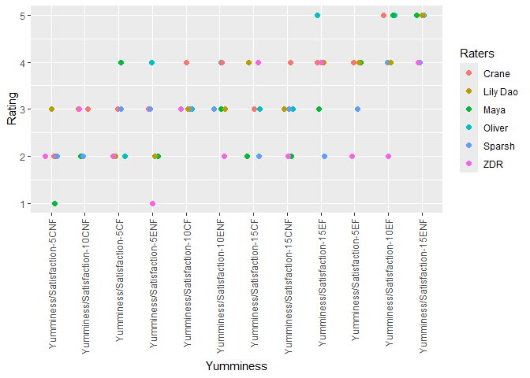

Cookie Taste using Cohen’s Kappa
================
Leslie, Oliver, Maya, Maya, Sparsh
2025-04-21

- [Set Up](#set-up)
- [Background Research](#background-research)
- [**Import file**](#import-file)
- [**Conduct Initial Checks - EDA**](#conduct-initial-checks---eda)
- [**Cohen’s Kappa**](#cohens-kappa)
  - [Maybe the core team has more
    agreement](#maybe-the-core-team-has-more-agreement)
- [**Graph Time**](#graph-time)

## Set Up

``` r
library(tidyverse)
```

    ## Warning: package 'tidyverse' was built under R version 4.4.2

    ## ── Attaching core tidyverse packages ──────────────────────── tidyverse 2.0.0 ──
    ## ✔ dplyr     1.1.4     ✔ readr     2.1.5
    ## ✔ forcats   1.0.0     ✔ stringr   1.5.1
    ## ✔ ggplot2   3.5.1     ✔ tibble    3.2.1
    ## ✔ lubridate 1.9.3     ✔ tidyr     1.3.1
    ## ✔ purrr     1.0.2     
    ## ── Conflicts ────────────────────────────────────────── tidyverse_conflicts() ──
    ## ✖ dplyr::filter() masks stats::filter()
    ## ✖ dplyr::lag()    masks stats::lag()
    ## ℹ Use the conflicted package (<http://conflicted.r-lib.org/>) to force all conflicts to become errors

``` r
library(modelr)
```

    ## Warning: package 'modelr' was built under R version 4.4.2

``` r
library(broom)
```

    ## Warning: package 'broom' was built under R version 4.4.2

    ## 
    ## Attaching package: 'broom'
    ## 
    ## The following object is masked from 'package:modelr':
    ## 
    ##     bootstrap

``` r
library(irr)
```

    ## Warning: package 'irr' was built under R version 4.4.2

    ## Loading required package: lpSolve

    ## Warning: package 'lpSolve' was built under R version 4.4.2

## Background Research

- What’s your question?
- What data do you plan to use to answer this question?
- What challenges do you anticipate encountering?
- What level of complexity of final product are you aiming for?
- What figures / tables do you anticipate producing?

## **Import file**

``` r
filename_cookie_taste <- "./data/Taste_Data.csv"
## NOTE: No need to edit
df_cookie_taste <-
  read_csv(
    filename_cookie_taste,
  )
```

    ## Rows: 6 Columns: 73
    ## ── Column specification ────────────────────────────────────────────────────────
    ## Delimiter: ","
    ## chr  (1): Name
    ## dbl (72): Yumminess/Satisfaction-5CNF, Flavor-5CNF, Texture-5CNF, Chocolatey...
    ## 
    ## ℹ Use `spec()` to retrieve the full column specification for this data.
    ## ℹ Specify the column types or set `show_col_types = FALSE` to quiet this message.

``` r
df_cookie_taste
```

    ## # A tibble: 6 × 73
    ##   Name     `Yumminess/Satisfaction-5CNF` `Flavor-5CNF` `Texture-5CNF`
    ##   <chr>                            <dbl>         <dbl>          <dbl>
    ## 1 Oliver                               2             3              2
    ## 2 Crane                                2             3              2
    ## 3 Maya                                 1             2              1
    ## 4 Sparsh                               2             2              2
    ## 5 Lily Dao                             3             3              2
    ## 6 ZDR                                  2             2              3
    ## # ℹ 69 more variables: `Chocolatey-ness-5CNF` <dbl>, `Crispiness-5CNF` <dbl>,
    ## #   `Chewiness-5CNF` <dbl>, `Yumminess/Satisfaction-10CNF` <dbl>,
    ## #   `Flavor-10CNF` <dbl>, `Texture-10CNF` <dbl>, `Chocolatey-ness-10CNF` <dbl>,
    ## #   `Crispiness-10CNF` <dbl>, `Chewiness-10CNF` <dbl>,
    ## #   `Yumminess/Satisfaction-15CNF` <dbl>, `Flavor-15CNF` <dbl>,
    ## #   `Texture-15CNF` <dbl>, `Chocolatey-ness-15CNF` <dbl>,
    ## #   `Crispiness-15CNF` <dbl>, `Chewiness-15CNF` <dbl>, …

## **Conduct Initial Checks - EDA**

``` r
summary(df_cookie_taste)
```

    ##      Name           Yumminess/Satisfaction-5CNF  Flavor-5CNF   Texture-5CNF
    ##  Length:6           Min.   :1                   Min.   :2.0   Min.   :1    
    ##  Class :character   1st Qu.:2                   1st Qu.:2.0   1st Qu.:2    
    ##  Mode  :character   Median :2                   Median :2.5   Median :2    
    ##                     Mean   :2                   Mean   :2.5   Mean   :2    
    ##                     3rd Qu.:2                   3rd Qu.:3.0   3rd Qu.:2    
    ##                     Max.   :3                   Max.   :3.0   Max.   :3    
    ##  Chocolatey-ness-5CNF Crispiness-5CNF Chewiness-5CNF 
    ##  Min.   :1.00         Min.   :3.000   Min.   :2.000  
    ##  1st Qu.:1.25         1st Qu.:3.250   1st Qu.:2.250  
    ##  Median :2.00         Median :4.000   Median :3.500  
    ##  Mean   :2.00         Mean   :3.833   Mean   :3.167  
    ##  3rd Qu.:2.75         3rd Qu.:4.000   3rd Qu.:4.000  
    ##  Max.   :3.00         Max.   :5.000   Max.   :4.000  
    ##  Yumminess/Satisfaction-10CNF  Flavor-10CNF  Texture-10CNF 
    ##  Min.   :2.0                  Min.   :1.00   Min.   :1.00  
    ##  1st Qu.:2.0                  1st Qu.:2.25   1st Qu.:1.25  
    ##  Median :2.5                  Median :3.00   Median :2.00  
    ##  Mean   :2.5                  Mean   :2.50   Mean   :2.00  
    ##  3rd Qu.:3.0                  3rd Qu.:3.00   3rd Qu.:2.75  
    ##  Max.   :3.0                  Max.   :3.00   Max.   :3.00  
    ##  Chocolatey-ness-10CNF Crispiness-10CNF Chewiness-10CNF
    ##  Min.   :2.000         Min.   :2.00     Min.   :2.0    
    ##  1st Qu.:2.250         1st Qu.:2.25     1st Qu.:3.0    
    ##  Median :3.000         Median :3.00     Median :3.0    
    ##  Mean   :2.833         Mean   :3.00     Mean   :3.5    
    ##  3rd Qu.:3.000         3rd Qu.:3.75     3rd Qu.:4.5    
    ##  Max.   :4.000         Max.   :4.00     Max.   :5.0    
    ##  Yumminess/Satisfaction-15CNF  Flavor-15CNF  Texture-15CNF
    ##  Min.   :2.000                Min.   :2.00   Min.   :2    
    ##  1st Qu.:2.250                1st Qu.:2.25   1st Qu.:3    
    ##  Median :3.000                Median :3.00   Median :3    
    ##  Mean   :2.833                Mean   :3.00   Mean   :3    
    ##  3rd Qu.:3.000                3rd Qu.:3.75   3rd Qu.:3    
    ##  Max.   :4.000                Max.   :4.00   Max.   :4    
    ##  Chocolatey-ness-15CNF Crispiness-15CNF Chewiness-15CNF
    ##  Min.   :3.000         Min.   :2.00     Min.   :4.000  
    ##  1st Qu.:4.000         1st Qu.:2.25     1st Qu.:4.000  
    ##  Median :4.000         Median :3.00     Median :4.000  
    ##  Mean   :4.167         Mean   :3.00     Mean   :4.167  
    ##  3rd Qu.:4.750         3rd Qu.:3.75     3rd Qu.:4.000  
    ##  Max.   :5.000         Max.   :4.00     Max.   :5.000  
    ##  Yumminess/Satisfaction-5CF   Flavor-5CF  Texture-5CF  Chocolatey-ness-5CF
    ##  Min.   :2.000              Min.   :2    Min.   :3.0   Min.   :1.0        
    ##  1st Qu.:2.000              1st Qu.:3    1st Qu.:3.0   1st Qu.:1.0        
    ##  Median :2.500              Median :3    Median :3.5   Median :1.5        
    ##  Mean   :2.667              Mean   :3    Mean   :3.5   Mean   :1.5        
    ##  3rd Qu.:3.000              3rd Qu.:3    3rd Qu.:4.0   3rd Qu.:2.0        
    ##  Max.   :4.000              Max.   :4    Max.   :4.0   Max.   :2.0        
    ##  Crispiness-5CF Chewiness-5CF   Yumminess/Satisfaction-10CF  Flavor-10CF
    ##  Min.   :1.0    Min.   :2.000   Min.   :3.000               Min.   :3   
    ##  1st Qu.:2.0    1st Qu.:3.000   1st Qu.:3.000               1st Qu.:3   
    ##  Median :2.5    Median :3.500   Median :3.000               Median :3   
    ##  Mean   :2.5    Mean   :3.333   Mean   :3.167               Mean   :3   
    ##  3rd Qu.:3.0    3rd Qu.:4.000   3rd Qu.:3.000               3rd Qu.:3   
    ##  Max.   :4.0    Max.   :4.000   Max.   :4.000               Max.   :3   
    ##   Texture-10CF   Chocolatey-ness-10CF Crispiness-10CF Chewiness-10CF 
    ##  Min.   :2.000   Min.   :2.000        Min.   :2.000   Min.   :3.000  
    ##  1st Qu.:3.000   1st Qu.:2.250        1st Qu.:2.250   1st Qu.:4.000  
    ##  Median :3.500   Median :3.000        Median :3.000   Median :4.000  
    ##  Mean   :3.333   Mean   :2.833        Mean   :2.833   Mean   :3.833  
    ##  3rd Qu.:4.000   3rd Qu.:3.000        3rd Qu.:3.000   3rd Qu.:4.000  
    ##  Max.   :4.000   Max.   :4.000        Max.   :4.000   Max.   :4.000  
    ##  Yumminess/Satisfaction-15CF  Flavor-15CF     Texture-15CF 
    ##  Min.   :2.00                Min.   :1.000   Min.   :2.00  
    ##  1st Qu.:2.25                1st Qu.:2.250   1st Qu.:2.25  
    ##  Median :3.00                Median :3.000   Median :3.00  
    ##  Mean   :3.00                Mean   :2.667   Mean   :3.00  
    ##  3rd Qu.:3.75                3rd Qu.:3.000   3rd Qu.:3.00  
    ##  Max.   :4.00                Max.   :4.000   Max.   :5.00  
    ##  Chocolatey-ness-15CF Crispiness-15CF Chewiness-15CF Yumminess/Satisfaction-5EF
    ##  Min.   :2.00         Min.   :1.000   Min.   :3.00   Min.   :2.00              
    ##  1st Qu.:3.25         1st Qu.:1.250   1st Qu.:3.25   1st Qu.:3.25              
    ##  Median :4.50         Median :2.000   Median :4.00   Median :4.00              
    ##  Mean   :4.00         Mean   :2.167   Mean   :4.00   Mean   :3.50              
    ##  3rd Qu.:5.00         3rd Qu.:2.750   3rd Qu.:4.75   3rd Qu.:4.00              
    ##  Max.   :5.00         Max.   :4.000   Max.   :5.00   Max.   :4.00              
    ##    Flavor-5EF     Texture-5EF   Chocolatey-ness-5EF Crispiness-5EF 
    ##  Min.   :2.000   Min.   :3.00   Min.   :1.00        Min.   :2.000  
    ##  1st Qu.:3.250   1st Qu.:3.25   1st Qu.:1.25        1st Qu.:2.000  
    ##  Median :4.000   Median :4.00   Median :2.00        Median :2.000  
    ##  Mean   :3.833   Mean   :4.00   Mean   :2.00        Mean   :2.333  
    ##  3rd Qu.:4.750   3rd Qu.:4.75   3rd Qu.:2.75        3rd Qu.:2.000  
    ##  Max.   :5.000   Max.   :5.00   Max.   :3.00        Max.   :4.000  
    ##  Chewiness-5EF Yumminess/Satisfaction-10EF  Flavor-10EF    Texture-10EF  
    ##  Min.   :2.0   Min.   :2.000               Min.   :2.00   Min.   :3.000  
    ##  1st Qu.:3.0   1st Qu.:4.000               1st Qu.:4.00   1st Qu.:4.000  
    ##  Median :3.5   Median :4.500               Median :4.00   Median :4.500  
    ##  Mean   :3.5   Mean   :4.167               Mean   :4.00   Mean   :4.333  
    ##  3rd Qu.:4.0   3rd Qu.:5.000               3rd Qu.:4.75   3rd Qu.:5.000  
    ##  Max.   :5.0   Max.   :5.000               Max.   :5.00   Max.   :5.000  
    ##  Chocolatey-ness-10EF Crispiness-10EF Chewiness-10EF 
    ##  Min.   :2.000        Min.   :2.000   Min.   :3.000  
    ##  1st Qu.:2.500        1st Qu.:3.000   1st Qu.:3.000  
    ##  Median :4.000        Median :3.000   Median :3.500  
    ##  Mean   :3.667        Mean   :3.167   Mean   :3.833  
    ##  3rd Qu.:4.750        3rd Qu.:3.750   3rd Qu.:4.750  
    ##  Max.   :5.000        Max.   :4.000   Max.   :5.000  
    ##  Yumminess/Satisfaction-15EF  Flavor-15EF   Texture-15EF  Chocolatey-ness-15EF
    ##  Min.   :2.000               Min.   :2.0   Min.   :2.00   Min.   :4.000       
    ##  1st Qu.:3.250               1st Qu.:2.5   1st Qu.:2.25   1st Qu.:5.000       
    ##  Median :4.000               Median :4.0   Median :3.50   Median :5.000       
    ##  Mean   :3.667               Mean   :3.5   Mean   :3.50   Mean   :4.833       
    ##  3rd Qu.:4.000               3rd Qu.:4.0   3rd Qu.:4.75   3rd Qu.:5.000       
    ##  Max.   :5.000               Max.   :5.0   Max.   :5.00   Max.   :5.000       
    ##  Crispiness-15EF Chewiness-15EF  Yumminess/Satisfaction-5ENF  Flavor-5ENF   
    ##  Min.   :1.000   Min.   :2.000   Min.   :1.0                 Min.   :1.000  
    ##  1st Qu.:2.000   1st Qu.:2.500   1st Qu.:2.0                 1st Qu.:3.000  
    ##  Median :2.500   Median :4.000   Median :2.5                 Median :3.500  
    ##  Mean   :2.667   Mean   :3.667   Mean   :2.5                 Mean   :3.333  
    ##  3rd Qu.:3.000   3rd Qu.:4.750   3rd Qu.:3.0                 3rd Qu.:4.000  
    ##  Max.   :5.000   Max.   :5.000   Max.   :4.0                 Max.   :5.000  
    ##   Texture-5ENF   Chocolatey-ness-5ENF Crispiness-5ENF Chewiness-5ENF 
    ##  Min.   :2.000   Min.   :1.000        Min.   :1       Min.   :2.000  
    ##  1st Qu.:2.000   1st Qu.:1.250        1st Qu.:2       1st Qu.:3.250  
    ##  Median :2.000   Median :2.500        Median :3       Median :4.000  
    ##  Mean   :2.667   Mean   :2.167        Mean   :3       Mean   :3.667  
    ##  3rd Qu.:2.750   3rd Qu.:3.000        3rd Qu.:4       3rd Qu.:4.000  
    ##  Max.   :5.000   Max.   :3.000        Max.   :5       Max.   :5.000  
    ##  Yumminess/Satisfaction-10ENF  Flavor-10ENF  Texture-10ENF  
    ##  Min.   :2.000                Min.   :1.00   Min.   :2.000  
    ##  1st Qu.:3.000                1st Qu.:2.25   1st Qu.:2.000  
    ##  Median :3.000                Median :3.50   Median :2.500  
    ##  Mean   :3.167                Mean   :3.00   Mean   :3.167  
    ##  3rd Qu.:3.750                3rd Qu.:4.00   3rd Qu.:4.500  
    ##  Max.   :4.000                Max.   :4.00   Max.   :5.000  
    ##  Chocolatey-ness-10ENF Crispiness-10ENF Chewiness-10ENF
    ##  Min.   :2.000         Min.   :1.00     Min.   :3.00   
    ##  1st Qu.:3.250         1st Qu.:2.25     1st Qu.:3.25   
    ##  Median :4.000         Median :3.00     Median :4.00   
    ##  Mean   :3.667         Mean   :3.00     Mean   :4.00   
    ##  3rd Qu.:4.000         3rd Qu.:3.75     3rd Qu.:4.75   
    ##  Max.   :5.000         Max.   :5.00     Max.   :5.00   
    ##  Yumminess/Satisfaction-15ENF  Flavor-15ENF  Texture-15ENF  
    ##  Min.   :4.000                Min.   :3.00   Min.   :3.000  
    ##  1st Qu.:4.250                1st Qu.:3.25   1st Qu.:4.000  
    ##  Median :5.000                Median :4.00   Median :4.500  
    ##  Mean   :4.667                Mean   :4.00   Mean   :4.333  
    ##  3rd Qu.:5.000                3rd Qu.:4.75   3rd Qu.:5.000  
    ##  Max.   :5.000                Max.   :5.00   Max.   :5.000  
    ##  Chocolatey-ness-15ENF Crispiness-15ENF Chewiness-15ENF
    ##  Min.   :4.0           Min.   :1.000    Min.   :2.000  
    ##  1st Qu.:4.0           1st Qu.:2.250    1st Qu.:3.250  
    ##  Median :4.5           Median :3.000    Median :4.000  
    ##  Mean   :4.5           Mean   :2.833    Mean   :3.667  
    ##  3rd Qu.:5.0           3rd Qu.:3.000    3rd Qu.:4.000  
    ##  Max.   :5.0           Max.   :5.000    Max.   :5.000

``` r
head(df_cookie_taste)
```

    ## # A tibble: 6 × 73
    ##   Name     `Yumminess/Satisfaction-5CNF` `Flavor-5CNF` `Texture-5CNF`
    ##   <chr>                            <dbl>         <dbl>          <dbl>
    ## 1 Oliver                               2             3              2
    ## 2 Crane                                2             3              2
    ## 3 Maya                                 1             2              1
    ## 4 Sparsh                               2             2              2
    ## 5 Lily Dao                             3             3              2
    ## 6 ZDR                                  2             2              3
    ## # ℹ 69 more variables: `Chocolatey-ness-5CNF` <dbl>, `Crispiness-5CNF` <dbl>,
    ## #   `Chewiness-5CNF` <dbl>, `Yumminess/Satisfaction-10CNF` <dbl>,
    ## #   `Flavor-10CNF` <dbl>, `Texture-10CNF` <dbl>, `Chocolatey-ness-10CNF` <dbl>,
    ## #   `Crispiness-10CNF` <dbl>, `Chewiness-10CNF` <dbl>,
    ## #   `Yumminess/Satisfaction-15CNF` <dbl>, `Flavor-15CNF` <dbl>,
    ## #   `Texture-15CNF` <dbl>, `Chocolatey-ness-15CNF` <dbl>,
    ## #   `Crispiness-15CNF` <dbl>, `Chewiness-15CNF` <dbl>, …

#### Quantify sources of uncertainty

- How reputable is the source? How well-documented are their
  data-collection procedures? What potential errors might be in the
  data? What factors could contribute to missingness in the data?
- How were the data collected? Is it a random sample? A non-random
  sample? A full population?
- To the extent possible, report all estimates with confidence /
  prediction / tolerance intervals. If not possible, clearly explain why
  it is not possible to provide intervals and document what sources of
  uncertainty are not quantified.

#### Obeservations

- ….
- ….

## **Cohen’s Kappa**

How to interception Cohen’s Kappa from Geeks for Geeks

Kappa:

k=1: Perfect agreement beyond chance. k=0: Agreement equal to that
expected by chance alone. k=−1: Perfect disagreement beyond chance.

\####Interpretation of Cohen’s Kappa values Almost Perfect Agreement
(0.81 - 1.00): - Indicates very high agreement between the raters. -
Almost all observed agreement is due to actual agreement, with minimal
disagreement.

Substantial Agreement (0.61 - 0.80): - Represents a strong level of
agreement between raters. - A significant portion of the observed
agreement is beyond what would be expected by chance.

Moderate Agreement (0.41 - 0.60): - Suggests a moderate level of
agreement. - There is agreement, but there is still a notable amount of
variability that cannot be attributed to agreement alone.

Fair Agreement (0.21 - 0.40): - Indicates a fair level of agreement. -
Some agreement is present, but it may not be strong, and a substantial
amount of variability exists.

Slight Agreement (0.00 - 0.20): - Represents a slight level of
agreement. - The observed agreement is minimal, and most of it could be
due to chance.

Poor Agreement (\< 0.00): - Signifies poor agreement, meaning the
observed agreement is less than what would be expected by chance alone.

``` r
df_taste <- df_cookie_taste %>% 
  select(-Name)

df_taste2 <- t(df_taste)

kappam.light(df_taste2)
```

    ##  Light's Kappa for m Raters
    ## 
    ##  Subjects = 72 
    ##    Raters = 6 
    ##     Kappa = 0.0779 
    ## 
    ##         z = 0.418 
    ##   p-value = 0.676

``` r
df_yummy <-
df_taste %>% 
select(starts_with("Yum"))

df_yummy <- t(df_yummy)

kappam.light(df_yummy)
```

    ##  Light's Kappa for m Raters
    ## 
    ##  Subjects = 12 
    ##    Raters = 6 
    ##     Kappa = 0.099 
    ## 
    ##         z = 0.165 
    ##   p-value = 0.869

``` r
df_flavor <-
df_taste %>% 
select(starts_with("Flavor"))

df_flavor <- t(df_flavor)

kappam.light(df_flavor)
```

    ##  Light's Kappa for m Raters
    ## 
    ##  Subjects = 12 
    ##    Raters = 6 
    ##     Kappa = 0.0948 
    ## 
    ##         z = 0.159 
    ##   p-value = 0.874

``` r
df_texture <-
df_taste %>% 
select(starts_with("Text"))

df_texture <- t(df_texture)

kappam.light(df_texture)
```

    ##  Light's Kappa for m Raters
    ## 
    ##  Subjects = 12 
    ##    Raters = 6 
    ##     Kappa = 0.103 
    ## 
    ##         z = 0.282 
    ##   p-value = 0.778

``` r
df_chocolatey <-
df_taste %>% 
select(starts_with("Chocolatey"))

df_chocolatey <- t(df_chocolatey)

kappam.light(df_chocolatey)
```

    ##  Light's Kappa for m Raters
    ## 
    ##  Subjects = 12 
    ##    Raters = 6 
    ##     Kappa = 0.131 
    ## 
    ##         z = 0.555 
    ##   p-value = 0.579

``` r
df_crispiness <-
df_taste %>% 
select(starts_with("Crispiness"))

df_crispiness <- t(df_crispiness)

kappam.light(df_crispiness)
```

    ##  Light's Kappa for m Raters
    ## 
    ##  Subjects = 12 
    ##    Raters = 6 
    ##     Kappa = -0.00668 
    ## 
    ##         z = -0.0149 
    ##   p-value = 0.988

``` r
df_chewiness <-
df_taste %>% 
select(starts_with("Chewiness"))

df_chewiness <- t(df_chewiness)

kappam.light(df_chewiness)
```

    ##  Light's Kappa for m Raters
    ## 
    ##  Subjects = 12 
    ##    Raters = 6 
    ##     Kappa = 0.00832 
    ## 
    ##         z = 0.00898 
    ##   p-value = 0.993

### Maybe the core team has more agreement

``` r
df_core <-
df_cookie_taste %>% 
  filter(Name == "Oliver" | Name == "Crane" | Name == "Maya" | Name == "Sparsh") %>% 
  select(-Name)

df_core2 <- t(df_core)

kappam.light(df_core2)
```

    ## Warning in sqrt(varkappa): NaNs produced

    ##  Light's Kappa for m Raters
    ## 
    ##  Subjects = 72 
    ##    Raters = 4 
    ##     Kappa = 0.105 
    ## 
    ##         z = NaN 
    ##   p-value = NaN

``` r
df_yummy2 <-
df_core %>% 
select(starts_with("Yum"))

df_yummy2 <- t(df_yummy2)

kappam.light(df_yummy2)
```

    ## Warning in sqrt(varkappa): NaNs produced

    ##  Light's Kappa for m Raters
    ## 
    ##  Subjects = 12 
    ##    Raters = 4 
    ##     Kappa = 0.136 
    ## 
    ##         z = NaN 
    ##   p-value = NaN

## **Graph Time**

``` r
df_graph <-
df_cookie_taste %>% 
select(Name,starts_with("Yum")) %>% 
pivot_longer(
    names_to = "Yummy",
    values_to = "n",
    cols = c('Yumminess/Satisfaction-5CNF', 'Yumminess/Satisfaction-10CNF', 'Yumminess/Satisfaction-15CNF', 'Yumminess/Satisfaction-5CF', 'Yumminess/Satisfaction-10CF', 'Yumminess/Satisfaction-15CF', 'Yumminess/Satisfaction-5EF', 'Yumminess/Satisfaction-10EF', 'Yumminess/Satisfaction-15EF', 'Yumminess/Satisfaction-5ENF','Yumminess/Satisfaction-10ENF', 'Yumminess/Satisfaction-15ENF')
  ) %>% 
mutate(
    Yummy = fct_reorder(Yummy, n)
  ) 

df_graph %>% 
ggplot(aes(Yummy, n, color = Name)) +
  geom_point(size = 2 , position = position_jitter(w = 0.2, h = 0)) +
  labs(
    x = "Yumminess",
    y = "Rating",
    color = "Raters"
  ) +
  theme(axis.text.x = element_text(angle = 90, vjust = 0.5, hjust=1))
```

<!-- -->

``` r
df_graph %>% 
ggplot(aes(Yummy, n)) +
  geom_boxplot() +
  labs(
    x = "Yumminess",
    y = "Rating"
  ) +
  theme(axis.text.x = element_text(angle = 90, vjust = 0.5, hjust=1))
```

<!-- -->

``` r
filename_top3<- "./data/top3.csv"
## NOTE: No need to edit
df_top3 <-
  read_csv(
    filename_top3,
  )
```

    ## Rows: 4 Columns: 7
    ## ── Column specification ────────────────────────────────────────────────────────
    ## Delimiter: ","
    ## chr (7): Name, Oliver, Sparsh, Crane, Maya, ZDR, LilyDao
    ## 
    ## ℹ Use `spec()` to retrieve the full column specification for this data.
    ## ℹ Specify the column types or set `show_col_types = FALSE` to quiet this message.

``` r
df_top3
```

    ## # A tibble: 4 × 7
    ##   Name       Oliver            Sparsh            Crane       Maya  ZDR   LilyDao
    ##   <chr>      <chr>             <chr>             <chr>       <chr> <chr> <chr>  
    ## 1 First      10_fancy_fridge   10_fancy_fridge   10_fancy_f… 5_fa… 15_f… 10_che…
    ## 2 Second     15_fancy_fridge   15_fancy_fridge   15_fancy_f… 15_f… 15_f… 10_exp…
    ## 3 Third      10_fancy_nofridge 10_fancy_nofridge 10_fancy_n… 10_f… 15_c… 15_che…
    ## 4 best_cheap 15_cheap_fridge   15_cheap_fridge   15_cheap_f… 10_c… 15_c… 10_che…

``` r
top3 <- 
  df_top3 %>% 
  filter(Name == "First" | Name == "Second" | Name == "Third")

kappam.light(top3)
```

    ## Warning in sqrt(varkappa): NaNs produced

    ##  Light's Kappa for m Raters
    ## 
    ##  Subjects = 3 
    ##    Raters = 7 
    ##     Kappa = 0.131 
    ## 
    ##         z = NaN 
    ##   p-value = NaN
