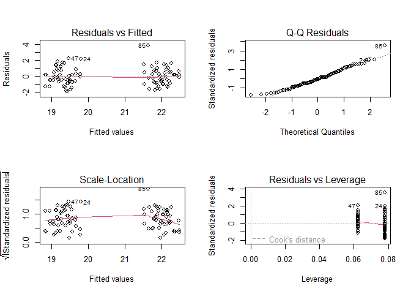
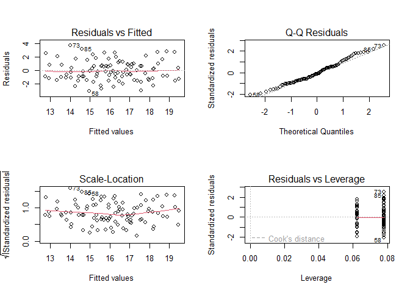
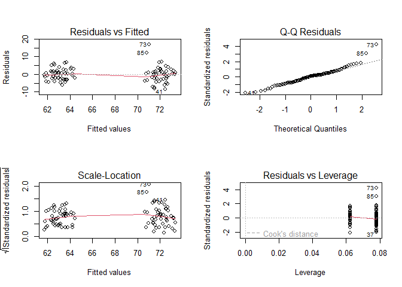
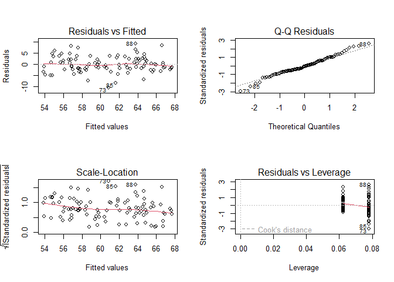
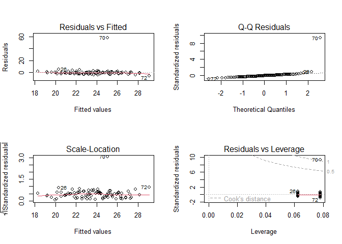
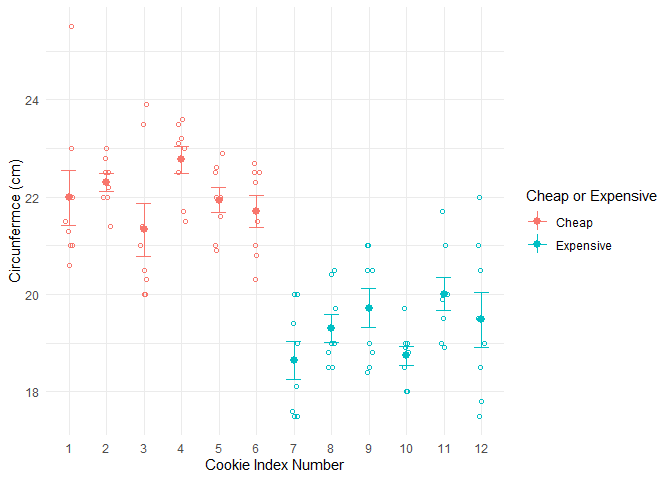
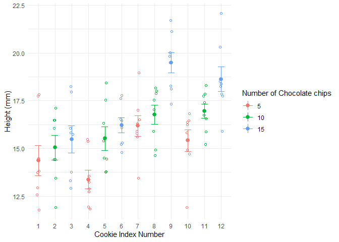
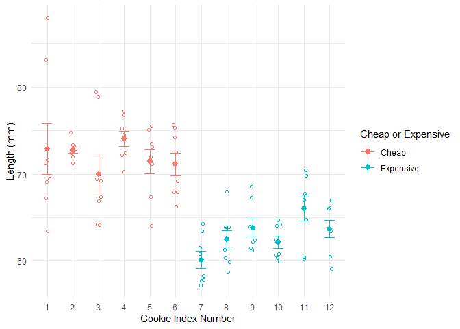
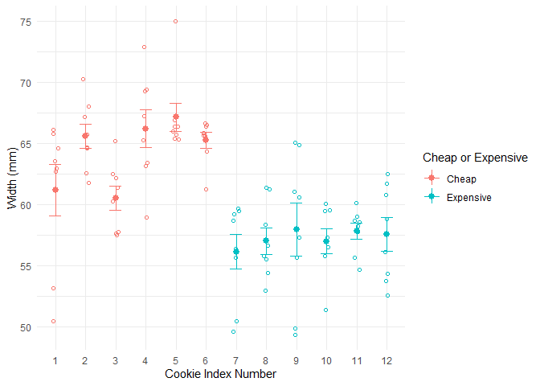
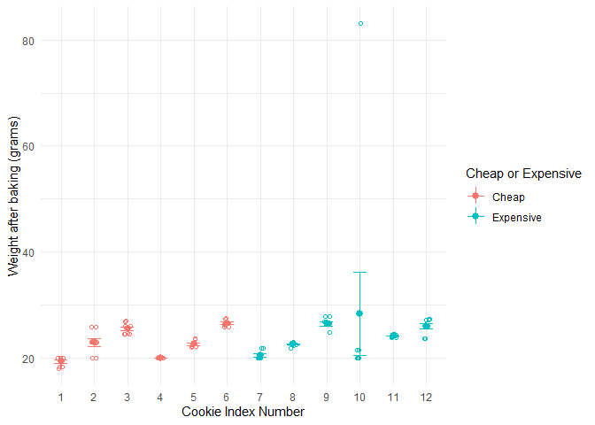

Cookie Quality using Gage R&R
================
Leslie, Oliver, Maya, Maya, Sparsh
2025-04-21

- [Set Up](#set-up)
- [Background Research](#background-research)
- [**Import file**](#import-file)
- [**Conduct Initial Checks - EDA**](#conduct-initial-checks---eda)
- [**Conduct ANOVA**](#conduct-anova)
  - [Circumference](#circumference)
  - [Height](#height)
  - [Length](#length)
  - [Width](#width)
  - [Weight](#weight)
- [**Tukey Honestly Significant
  Difference**](#tukey-honestly-significant-difference)
- [**Mean of Outputs**](#mean-of-outputs)
- [**Graph Time**](#graph-time)

## Set Up

``` r
library(tidyverse)
```

    ## Warning: package 'tidyverse' was built under R version 4.4.2

    ## ── Attaching core tidyverse packages ──────────────────────── tidyverse 2.0.0 ──
    ## ✔ dplyr     1.1.4     ✔ readr     2.1.5
    ## ✔ forcats   1.0.0     ✔ stringr   1.5.1
    ## ✔ ggplot2   3.5.1     ✔ tibble    3.2.1
    ## ✔ lubridate 1.9.3     ✔ tidyr     1.3.1
    ## ✔ purrr     1.0.2     
    ## ── Conflicts ────────────────────────────────────────── tidyverse_conflicts() ──
    ## ✖ dplyr::filter() masks stats::filter()
    ## ✖ dplyr::lag()    masks stats::lag()
    ## ℹ Use the conflicted package (<http://conflicted.r-lib.org/>) to force all conflicts to become errors

``` r
library(modelr)
```

    ## Warning: package 'modelr' was built under R version 4.4.2

``` r
library(broom)
```

    ## Warning: package 'broom' was built under R version 4.4.2

    ## 
    ## Attaching package: 'broom'
    ## 
    ## The following object is masked from 'package:modelr':
    ## 
    ##     bootstrap

## Background Research

- What’s your question?
- What data do you plan to use to answer this question?
- What challenges do you anticipate encountering?
- What level of complexity of final product are you aiming for?
- What figures / tables do you anticipate producing?

## **Import file**

``` r
filename_cookie <- "./data/results_gage_R_R.csv"
## NOTE: No need to edit
df_cookie <-
  read_csv(
    filename_cookie,
  )
```

    ## Rows: 96 Columns: 11
    ## ── Column specification ────────────────────────────────────────────────────────
    ## Delimiter: ","
    ## chr (3): Fridge, Cheap, Data_taker
    ## dbl (8): Index, Tray, Chocolate_chips, Height, Length, Width, Circumference,...
    ## 
    ## ℹ Use `spec()` to retrieve the full column specification for this data.
    ## ℹ Specify the column types or set `show_col_types = FALSE` to quiet this message.

``` r
df_cookie
```

    ## # A tibble: 96 × 11
    ##    Index  Tray Fridge    Cheap Chocolate_chips Height Length Width Circumference
    ##    <dbl> <dbl> <chr>     <chr>           <dbl>  <dbl>  <dbl> <dbl>         <dbl>
    ##  1     1     1 No fridge Cheap               5   13.8   69.5  63.5          22  
    ##  2     2     1 No fridge Cheap              10   16.0   73.2  68.0          23  
    ##  3     3     1 No fridge Cheap              15   12.9   79.4  65.2          23.5
    ##  4     4     1 No fridge Cheap               5   15.4   74.5  67.2          22.5
    ##  5     5     1 No fridge Cheap              10   14.4   73.1  65.3          22.5
    ##  6     6     1 No fridge Cheap              15   15.2   75.3  65.6          22.5
    ##  7     7     1 No fridge Expe…               5   15.9   57.2  55.6          17.5
    ##  8     8     1 No fridge Expe…              10   17.9   63.8  54.4          18.5
    ##  9     9     1 No fridge Expe…              15   20.0   62.2  55.6          18.5
    ## 10    10     1 No fridge Expe…               5   14.9   62.4  59.5          19  
    ## # ℹ 86 more rows
    ## # ℹ 2 more variables: Weight <dbl>, Data_taker <chr>

## **Conduct Initial Checks - EDA**

``` r
summary(df_cookie)
```

    ##      Index            Tray         Fridge             Cheap          
    ##  Min.   : 1.00   Min.   :1.00   Length:96          Length:96         
    ##  1st Qu.: 3.75   1st Qu.:1.75   Class :character   Class :character  
    ##  Median : 6.50   Median :2.50   Mode  :character   Mode  :character  
    ##  Mean   : 6.50   Mean   :2.50                                        
    ##  3rd Qu.: 9.25   3rd Qu.:3.25                                        
    ##  Max.   :12.00   Max.   :4.00                                        
    ##  Chocolate_chips     Height          Length          Width      
    ##  Min.   : 5      Min.   :11.79   Min.   :57.24   Min.   :49.37  
    ##  1st Qu.: 5      1st Qu.:14.48   1st Qu.:63.41   1st Qu.:57.14  
    ##  Median :10      Median :16.16   Median :67.27   Median :60.91  
    ##  Mean   :10      Mean   :16.12   Mean   :67.54   Mean   :60.77  
    ##  3rd Qu.:15      3rd Qu.:17.75   3rd Qu.:72.21   3rd Qu.:65.25  
    ##  Max.   :15      Max.   :22.07   Max.   :87.91   Max.   :74.95  
    ##  Circumference       Weight       Data_taker       
    ##  Min.   :17.50   Min.   :18.00   Length:96         
    ##  1st Qu.:19.00   1st Qu.:20.00   Class :character  
    ##  Median :20.70   Median :23.00   Mode  :character  
    ##  Mean   :20.66   Mean   :23.69                     
    ##  3rd Qu.:22.00   3rd Qu.:25.80                     
    ##  Max.   :25.50   Max.   :83.09

``` r
head(df_cookie)
```

    ## # A tibble: 6 × 11
    ##   Index  Tray Fridge    Cheap Chocolate_chips Height Length Width Circumference
    ##   <dbl> <dbl> <chr>     <chr>           <dbl>  <dbl>  <dbl> <dbl>         <dbl>
    ## 1     1     1 No fridge Cheap               5   13.8   69.5  63.5          22  
    ## 2     2     1 No fridge Cheap              10   16.0   73.2  68.0          23  
    ## 3     3     1 No fridge Cheap              15   12.9   79.4  65.2          23.5
    ## 4     4     1 No fridge Cheap               5   15.4   74.5  67.2          22.5
    ## 5     5     1 No fridge Cheap              10   14.4   73.1  65.3          22.5
    ## 6     6     1 No fridge Cheap              15   15.2   75.3  65.6          22.5
    ## # ℹ 2 more variables: Weight <dbl>, Data_taker <chr>

#### Quantify sources of uncertainty

- How reputable is the source? How well-documented are their
  data-collection procedures? What potential errors might be in the
  data? What factors could contribute to missingness in the data?
- How were the data collected? Is it a random sample? A non-random
  sample? A full population?
- To the extent possible, report all estimates with confidence /
  prediction / tolerance intervals. If not possible, clearly explain why
  it is not possible to provide intervals and document what sources of
  uncertainty are not quantified. \#### Obeservations
- ….
- ….

## **Conduct ANOVA**

### Circumference

``` r
cookie.cir <- aov(Circumference ~ Index + Tray + Fridge + Cheap + Chocolate_chips + Data_taker, data = df_cookie)

summary(cookie.cir)
```

    ##                 Df Sum Sq Mean Sq F value   Pr(>F)    
    ## Index            1 120.12  120.12  93.618 1.50e-15 ***
    ## Tray             1   3.71    3.71   2.891   0.0925 .  
    ## Fridge           1   0.63    0.63   0.492   0.4851    
    ## Cheap            1  54.78   54.78  42.694 3.88e-09 ***
    ## Chocolate_chips  1   0.20    0.20   0.158   0.6920    
    ## Data_taker       1   0.37    0.37   0.292   0.5901    
    ## Residuals       89 114.20    1.28                     
    ## ---
    ## Signif. codes:  0 '***' 0.001 '**' 0.01 '*' 0.05 '.' 0.1 ' ' 1

``` r
par(mfrow=c(2,2))
plot(cookie.cir)
```

<!-- -->

``` r
par(mfrow=c(1,1))
```

### Height

``` r
cookie.hei <- aov(Height ~ Index + Tray + Fridge + Cheap + Chocolate_chips + Data_taker, data = df_cookie)

summary(cookie.hei)
```

    ##                 Df Sum Sq Mean Sq F value   Pr(>F)    
    ## Index            1 134.36  134.36  55.755 5.32e-11 ***
    ## Tray             1   4.86    4.86   2.017  0.15905    
    ## Fridge           1  22.40   22.40   9.297  0.00302 ** 
    ## Cheap            1   3.36    3.36   1.393  0.24099    
    ## Chocolate_chips  1  93.54   93.54  38.818 1.51e-08 ***
    ## Data_taker       1   8.81    8.81   3.655  0.05910 .  
    ## Residuals       89 214.47    2.41                     
    ## ---
    ## Signif. codes:  0 '***' 0.001 '**' 0.01 '*' 0.05 '.' 0.1 ' ' 1

``` r
par(mfrow=c(2,2))
plot(cookie.hei)
```

<!-- -->

``` r
par(mfrow=c(1,1))
```

### Length

``` r
cookie.len <- aov(Length ~ Index + Tray + Fridge + Cheap + Chocolate_chips + Data_taker, data = df_cookie)

summary(cookie.len)
```

    ##                 Df Sum Sq Mean Sq F value   Pr(>F)    
    ## Index            1 1304.3  1304.3  75.457 1.67e-13 ***
    ## Tray             1   17.9    17.9   1.034    0.312    
    ## Fridge           1    1.7     1.7   0.098    0.755    
    ## Cheap            1  650.0   650.0  37.605 2.33e-08 ***
    ## Chocolate_chips  1    9.7     9.7   0.559    0.457    
    ## Data_taker       1    0.9     0.9   0.054    0.817    
    ## Residuals       89 1538.4    17.3                     
    ## ---
    ## Signif. codes:  0 '***' 0.001 '**' 0.01 '*' 0.05 '.' 0.1 ' ' 1

``` r
par(mfrow=c(2,2))
plot(cookie.len)
```

<!-- -->

``` r
par(mfrow=c(1,1))
```

### Width

``` r
cookie.wid <- aov(Width ~ Index + Tray + Fridge + Cheap + Chocolate_chips + Data_taker, data = df_cookie)

summary(cookie.wid)
```

    ##                 Df Sum Sq Mean Sq F value   Pr(>F)    
    ## Index            1  644.2   644.2  47.432 7.78e-10 ***
    ## Tray             1  202.2   202.2  14.886 0.000216 ***
    ## Fridge           1    2.9     2.9   0.216 0.643558    
    ## Cheap            1  638.9   638.9  47.043 8.86e-10 ***
    ## Chocolate_chips  1   17.0    17.0   1.251 0.266397    
    ## Data_taker       1   14.0    14.0   1.031 0.312609    
    ## Residuals       89 1208.8    13.6                     
    ## ---
    ## Signif. codes:  0 '***' 0.001 '**' 0.01 '*' 0.05 '.' 0.1 ' ' 1

``` r
par(mfrow=c(2,2))
plot(cookie.wid)
```

<!-- -->

``` r
par(mfrow=c(1,1))
```

### Weight

``` r
cookie.wei <- aov(Weight ~ Index + Tray + Fridge + Cheap + Chocolate_chips + Data_taker, data = df_cookie)

summary(cookie.wei)
```

    ##                 Df Sum Sq Mean Sq F value Pr(>F)  
    ## Index            1    235  234.74   5.572 0.0204 *
    ## Tray             1      4    4.01   0.095 0.7583  
    ## Fridge           1     38   38.35   0.910 0.3426  
    ## Cheap            1     76   76.40   1.814 0.1815  
    ## Chocolate_chips  1    105  105.48   2.504 0.1171  
    ## Data_taker       1     44   43.86   1.041 0.3103  
    ## Residuals       89   3749   42.13                 
    ## ---
    ## Signif. codes:  0 '***' 0.001 '**' 0.01 '*' 0.05 '.' 0.1 ' ' 1

``` r
par(mfrow=c(2,2))
plot(cookie.wei)
```

<!-- -->

``` r
par(mfrow=c(1,1))
```

## **Tukey Honestly Significant Difference**

``` r
tukey.cir<-TukeyHSD(cookie.cir)
```

    ## Warning in replications(paste("~", xx), data = mf): non-factors ignored: Index

    ## Warning in replications(paste("~", xx), data = mf): non-factors ignored: Tray

    ## Warning in replications(paste("~", xx), data = mf): non-factors ignored:
    ## Chocolate_chips

    ## Warning in TukeyHSD.aov(cookie.cir): 'which' specified some non-factors which
    ## will be dropped

``` r
tukey.hei<-TukeyHSD(cookie.hei)
```

    ## Warning in replications(paste("~", xx), data = mf): non-factors ignored: Index

    ## Warning in replications(paste("~", xx), data = mf): non-factors ignored: Tray

    ## Warning in replications(paste("~", xx), data = mf): non-factors ignored:
    ## Chocolate_chips

    ## Warning in TukeyHSD.aov(cookie.hei): 'which' specified some non-factors which
    ## will be dropped

``` r
tukey.len<-TukeyHSD(cookie.len)
```

    ## Warning in replications(paste("~", xx), data = mf): non-factors ignored: Index

    ## Warning in replications(paste("~", xx), data = mf): non-factors ignored: Tray

    ## Warning in replications(paste("~", xx), data = mf): non-factors ignored:
    ## Chocolate_chips

    ## Warning in TukeyHSD.aov(cookie.len): 'which' specified some non-factors which
    ## will be dropped

``` r
tukey.wid<-TukeyHSD(cookie.wid)
```

    ## Warning in replications(paste("~", xx), data = mf): non-factors ignored: Index

    ## Warning in replications(paste("~", xx), data = mf): non-factors ignored: Tray

    ## Warning in replications(paste("~", xx), data = mf): non-factors ignored:
    ## Chocolate_chips

    ## Warning in TukeyHSD.aov(cookie.wid): 'which' specified some non-factors which
    ## will be dropped

``` r
tukey.wei<-TukeyHSD(cookie.wei)
```

    ## Warning in replications(paste("~", xx), data = mf): non-factors ignored: Index

    ## Warning in replications(paste("~", xx), data = mf): non-factors ignored: Tray

    ## Warning in replications(paste("~", xx), data = mf): non-factors ignored:
    ## Chocolate_chips

    ## Warning in TukeyHSD.aov(cookie.wei): 'which' specified some non-factors which
    ## will be dropped

``` r
tukey.cir
```

    ##   Tukey multiple comparisons of means
    ##     95% family-wise confidence level
    ## 
    ## Fit: aov(formula = Circumference ~ Index + Tray + Fridge + Cheap + Chocolate_chips + Data_taker, data = df_cookie)
    ## 
    ## $Fridge
    ##                   diff        lwr       upr     p adj
    ## No fridge-Fridge 0.145 -0.3144288 0.6044288 0.5321933
    ## 
    ## $Cheap
    ##                       diff       lwr        upr     p adj
    ## Expensive-Cheap -0.7474359 -1.206865 -0.2880071 0.0017212
    ## 
    ## $Data_taker
    ##                diff        lwr       upr    p adj
    ## Maya M-Leslie 0.125 -0.3344288 0.5844288 0.590126

``` r
tukey.hei
```

    ##   Tukey multiple comparisons of means
    ##     95% family-wise confidence level
    ## 
    ## Fit: aov(formula = Height ~ Index + Tray + Fridge + Cheap + Chocolate_chips + Data_taker, data = df_cookie)
    ## 
    ## $Fridge
    ##                        diff       lwr        upr     p adj
    ## No fridge-Fridge -0.8641667 -1.493781 -0.2345523 0.0076939
    ## 
    ## $Cheap
    ##                      diff        lwr      upr     p adj
    ## Expensive-Cheap 0.1850437 -0.4445706 0.814658 0.5607155
    ## 
    ## $Data_taker
    ##                    diff       lwr      upr     p adj
    ## Maya M-Leslie 0.6058333 -0.023781 1.235448 0.0591024

``` r
tukey.len
```

    ##   Tukey multiple comparisons of means
    ##     95% family-wise confidence level
    ## 
    ## Fit: aov(formula = Length ~ Index + Tray + Fridge + Cheap + Chocolate_chips + Data_taker, data = df_cookie)
    ## 
    ## $Fridge
    ##                       diff      lwr      upr     p adj
    ## No fridge-Fridge 0.2373333 -1.44893 1.923597 0.7803892
    ## 
    ## $Cheap
    ##                      diff      lwr        upr     p adj
    ## Expensive-Cheap -2.574677 -4.26094 -0.8884131 0.0031648
    ## 
    ## $Data_taker
    ##                  diff       lwr      upr     p adj
    ## Maya M-Leslie -0.1975 -1.883763 1.488763 0.8165127

``` r
tukey.wid
```

    ##   Tukey multiple comparisons of means
    ##     95% family-wise confidence level
    ## 
    ## Fit: aov(formula = Width ~ Index + Tray + Fridge + Cheap + Chocolate_chips + Data_taker, data = df_cookie)
    ## 
    ## $Fridge
    ##                        diff       lwr      upr     p adj
    ## No fridge-Fridge -0.3124167 -1.807182 1.182349 0.6789272
    ## 
    ## $Cheap
    ##                      diff      lwr       upr     p adj
    ## Expensive-Cheap -2.552665 -4.04743 -1.057899 0.0010328
    ## 
    ## $Data_taker
    ##                    diff        lwr      upr     p adj
    ## Maya M-Leslie 0.7639583 -0.7308074 2.258724 0.3126094

``` r
tukey.wei
```

    ##   Tukey multiple comparisons of means
    ##     95% family-wise confidence level
    ## 
    ## Fit: aov(formula = Weight ~ Index + Tray + Fridge + Cheap + Chocolate_chips + Data_taker, data = df_cookie)
    ## 
    ## $Fridge
    ##                      diff       lwr      upr     p adj
    ## No fridge-Fridge 1.130583 -1.501937 3.763103 0.3957594
    ## 
    ## $Cheap
    ##                       diff       lwr      upr    p adj
    ## Expensive-Cheap -0.8827025 -3.515222 1.749817 0.506976
    ## 
    ## $Data_taker
    ##                   diff       lwr      upr     p adj
    ## Maya M-Leslie 1.351875 -1.280645 3.984395 0.3103182

## **Mean of Outputs**

``` r
mean.cir <- df_cookie %>%
  group_by(Index, Cheap) %>%
  summarise(
      cir = mean(Circumference)
  )
```

    ## `summarise()` has grouped output by 'Index'. You can override using the
    ## `.groups` argument.

``` r
mean.hei <- df_cookie %>%
  group_by(Index, Chocolate_chips) %>%
  summarise(
      hei = mean(Height)
  )
```

    ## `summarise()` has grouped output by 'Index'. You can override using the
    ## `.groups` argument.

``` r
mean.len <- df_cookie %>%
  group_by(Index, Cheap) %>%
  summarise(
      len = mean(Length)
  )
```

    ## `summarise()` has grouped output by 'Index'. You can override using the
    ## `.groups` argument.

``` r
mean.wid <- df_cookie %>%
  group_by(Index, Cheap) %>%
  summarise(
      wid = mean(Width)
  )
```

    ## `summarise()` has grouped output by 'Index'. You can override using the
    ## `.groups` argument.

``` r
mean.wei <- df_cookie %>%
  group_by(Index,Cheap) %>%
  summarise(
      wei = mean(Weight)
  )
```

    ## `summarise()` has grouped output by 'Index'. You can override using the
    ## `.groups` argument.

``` r
mean.cir
```

    ## # A tibble: 12 × 3
    ## # Groups:   Index [12]
    ##    Index Cheap       cir
    ##    <dbl> <chr>     <dbl>
    ##  1     1 Cheap      22.0
    ##  2     2 Cheap      22.3
    ##  3     3 Cheap      21.3
    ##  4     4 Cheap      22.8
    ##  5     5 Cheap      21.9
    ##  6     6 Cheap      21.7
    ##  7     7 Expensive  18.6
    ##  8     8 Expensive  19.3
    ##  9     9 Expensive  19.7
    ## 10    10 Expensive  18.7
    ## 11    11 Expensive  20  
    ## 12    12 Expensive  19.5

``` r
mean.hei
```

    ## # A tibble: 12 × 3
    ## # Groups:   Index [12]
    ##    Index Chocolate_chips   hei
    ##    <dbl>           <dbl> <dbl>
    ##  1     1               5  14.4
    ##  2     2              10  15.0
    ##  3     3              15  15.5
    ##  4     4               5  13.4
    ##  5     5              10  15.5
    ##  6     6              15  16.2
    ##  7     7               5  16.2
    ##  8     8              10  16.8
    ##  9     9              15  19.5
    ## 10    10               5  15.4
    ## 11    11              10  17.0
    ## 12    12              15  18.6

``` r
mean.len
```

    ## # A tibble: 12 × 3
    ## # Groups:   Index [12]
    ##    Index Cheap       len
    ##    <dbl> <chr>     <dbl>
    ##  1     1 Cheap      72.9
    ##  2     2 Cheap      72.8
    ##  3     3 Cheap      69.9
    ##  4     4 Cheap      74.1
    ##  5     5 Cheap      71.4
    ##  6     6 Cheap      71.1
    ##  7     7 Expensive  60.2
    ##  8     8 Expensive  62.5
    ##  9     9 Expensive  63.8
    ## 10    10 Expensive  62.2
    ## 11    11 Expensive  66.0
    ## 12    12 Expensive  63.7

``` r
mean.wid
```

    ## # A tibble: 12 × 3
    ## # Groups:   Index [12]
    ##    Index Cheap       wid
    ##    <dbl> <chr>     <dbl>
    ##  1     1 Cheap      61.1
    ##  2     2 Cheap      65.6
    ##  3     3 Cheap      60.5
    ##  4     4 Cheap      66.2
    ##  5     5 Cheap      67.1
    ##  6     6 Cheap      65.2
    ##  7     7 Expensive  56.1
    ##  8     8 Expensive  57.0
    ##  9     9 Expensive  58.0
    ## 10    10 Expensive  57.0
    ## 11    11 Expensive  57.8
    ## 12    12 Expensive  57.6

``` r
mean.wei
```

    ## # A tibble: 12 × 3
    ## # Groups:   Index [12]
    ##    Index Cheap       wei
    ##    <dbl> <chr>     <dbl>
    ##  1     1 Cheap      19.3
    ##  2     2 Cheap      22.9
    ##  3     3 Cheap      25.4
    ##  4     4 Cheap      20  
    ##  5     5 Cheap      22.6
    ##  6     6 Cheap      26.5
    ##  7     7 Expensive  20.4
    ##  8     8 Expensive  22.5
    ##  9     9 Expensive  26.4
    ## 10    10 Expensive  28.2
    ## 11    11 Expensive  24.1
    ## 12    12 Expensive  26.0

## **Graph Time**

``` r
df_cookie %>%
ggplot(aes(as.factor(Index), Circumference, color = as.factor(Cheap))) +
  geom_point(cex = 1.5, pch = 1.0,position = position_jitter(w = 0.1, h = 0)) +
  stat_summary(fun.data = 'mean_se', geom = 'errorbar', width = 0.4) +
  stat_summary(fun.data = 'mean_se', geom = 'pointrange') +
  labs(
    x = "Cookie Index Number",
    y = "Circunfermce (cm)",
    color = "Cheap or Expensive"
  ) +
  theme_minimal()
```

<!-- -->

``` r
df_cookie %>%
ggplot(aes(as.factor(Index), Height, color = as.factor(Chocolate_chips))) +
  geom_point(cex = 1.5, pch = 1.0,position = position_jitter(w = 0.1, h = 0)) +
  stat_summary(fun.data = 'mean_se', geom = 'errorbar', width = 0.4) +
  stat_summary(fun.data = 'mean_se', geom = 'pointrange') +
  labs(
    x = "Cookie Index Number",
    y = "Height (mm)",
    color = "Number of Chocolate chips"
  ) +
  theme_minimal()
```

<!-- -->

``` r
df_cookie %>% 
ggplot(aes(as.factor(Index), Length, color = as.factor(Cheap))) +
  geom_point(cex = 1.5, pch = 1.0,position = position_jitter(w = 0.1, h = 0)) +
  stat_summary(fun.data = 'mean_se', geom = 'errorbar', width = 0.4) +
  stat_summary(fun.data = 'mean_se', geom = 'pointrange') +
  labs(
    x = "Cookie Index Number",
    y = "Length (mm)",
    color = "Cheap or Expensive"
  ) +
  theme_minimal()
```

<!-- -->

``` r
df_cookie %>% 
ggplot(aes(as.factor(Index), Width, color = as.factor(Cheap))) +
  geom_point(cex = 1.5, pch = 1.0,position = position_jitter(w = 0.1, h = 0)) +
  stat_summary(fun.data = 'mean_se', geom = 'errorbar', width = 0.4) +
  stat_summary(fun.data = 'mean_se', geom = 'pointrange') +
  labs(
    x = "Cookie Index Number",
    y = "Width (mm)",
    color = "Cheap or Expensive"
  ) +
  theme_minimal()
```

<!-- -->

``` r
df_cookie %>% 
ggplot(aes(as.factor(Index), Weight, color = as.factor(Cheap))) +
  geom_point(cex = 1.5, pch = 1.0,position = position_jitter(w = 0.1, h = 0)) +
  stat_summary(fun.data = 'mean_se', geom = 'errorbar', width = 0.4) +
  stat_summary(fun.data = 'mean_se', geom = 'pointrange') + 
  labs(
    x = "Cookie Index Number",
    y = "Weight after baking (grams)",
    color = "Cheap or Expensive"
  ) +
  theme_minimal()
```

<!-- -->
